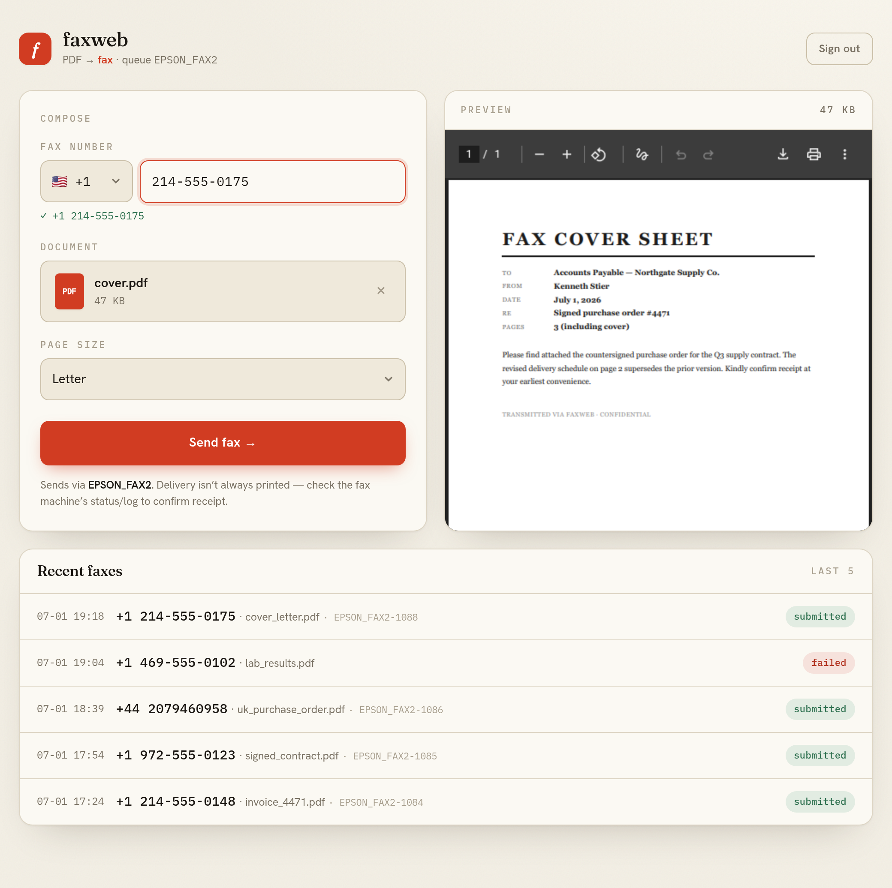

# faxweb

A tiny LAN web front-end for sending faxes through the Epson `EPSON_FAX2` CUPS
queue (ET‑5180 PC‑Fax). Upload a PDF, type a fax number, hit send. Shared‑password
gated, meant for a **trusted LAN** — not the public internet.



It's a single `app.py` (Flask, templates inline) so it copies to any host easily.

```
faxweb/
├── app.py              # the whole app
├── requirements.txt
├── faxweb.service      # systemd unit template
├── faxweb.env.example  # config template
└── data/               # uploads + jobs.jsonl + session key (created at runtime)
```

## How it works

Browser form → validates (PDF magic bytes, phone digits, size cap, CSRF) →
runs `epfax2 -P EPSON_FAX2 -o fax-number=<n> <file.pdf>` → records the CUPS job
and shows recent sends with live queue status.

**It must run on a host that has a working `EPSON_FAX2` fax queue.** The web
code doesn't talk to the printer directly — it shells out to `epfax2`, exactly
like your working command line.

## Quick local test (dry run — nothing is sent)

```bash
python3 -m venv .venv && ./.venv/bin/pip install -r requirements.txt
FAX_PASSWORD='testpass' FAX_DRY_RUN=1 ./.venv/bin/python app.py
# open http://127.0.0.1:8080
```

## Deploying on a separate server

If the machine running faxweb is **not** the one that already has the working
`EPSON_FAX2` queue, that server needs its **own** queue. The Epson fax backend
dials the printer over the network (`epsonfax2://<printer-ip>`), so any host on
the LAN can talk straight to the ET‑5180 — no dependency on the original machine.

### 1. Put the fax queue on the server

a. Install the Epson fax driver for the ET‑5180 (provides `/usr/bin/epfax2` and
   the `epsonfax2` CUPS backend). Get it from Epson support ("ET‑5180 → Fax
   Driver / Printer Utility") for your distro, or the AUR package on Arch. Verify:

   ```bash
   which epfax2 && ls /usr/lib/cups/backend/epsonfax2
   ```

b. Add the queue pointing at the printer. Easiest is to reuse the PPD from a
   machine that already has the queue — on **that** machine run:

   ```bash
   sudo cp /etc/cups/ppd/EPSON_FAX2.ppd /tmp/ && sudo chmod +r /tmp/EPSON_FAX2.ppd
   # copy /tmp/EPSON_FAX2.ppd to the target server, then there (use your printer's IP):
   sudo lpadmin -p EPSON_FAX2 -v epsonfax2://<printer-ip> -P EPSON_FAX2.ppd -E
   sudo cupsenable EPSON_FAX2 && sudo cupsaccept EPSON_FAX2
   ```

c. Confirm: `lpstat -v EPSON_FAX2` shows `epsonfax2://<printer-ip>`. Send one
   test fax from the CLI (`epfax2 -P EPSON_FAX2 -o fax-number=<your#> test.pdf`)
   before wiring up the web app.

### 2. Install the app

```bash
sudo useradd --system --home /opt/faxweb --shell /usr/sbin/nologin faxweb
sudo mkdir -p /opt/faxweb && sudo cp -r app.py requirements.txt /opt/faxweb/
sudo python3 -m venv /opt/faxweb/.venv
sudo /opt/faxweb/.venv/bin/pip install -r /opt/faxweb/requirements.txt
sudo mkdir -p /opt/faxweb/data
sudo chown -R faxweb:faxweb /opt/faxweb

# config
sudo install -m 600 -o faxweb -g faxweb faxweb.env.example /etc/faxweb.env
sudoedit /etc/faxweb.env      # set a real FAX_PASSWORD

# service (User=faxweb, Group=lp so it can reach CUPS)
sudo cp faxweb.service /etc/systemd/system/
sudo systemctl daemon-reload && sudo systemctl enable --now faxweb
systemctl status faxweb
```

Open the LAN firewall for the port if needed, e.g. `sudo ufw allow 8080/tcp`.
Then browse to `http://<homeserver-ip>:8080`.

## Configuration

All via environment variables — see `faxweb.env.example`. Key ones:
`FAX_PASSWORD` (required), `FAX_QUEUE`, `FAX_BIND`, `FAX_PORT`, `FAX_MAX_MB`,
`FAX_DRY_RUN`.

## Security notes

- **Trusted LAN only.** Traffic is plain HTTP, so the shared password crosses
  the network in the clear. Fine inside a home LAN; do **not** port‑forward it.
  If you want it reachable more widely, put it behind a reverse proxy (Caddy/
  nginx) with TLS and bind the app to `127.0.0.1`.
- Guards in place: shared‑password login, signed session cookie, CSRF tokens on
  every POST, PDF‑only with magic‑byte check, filename sanitizing, size cap,
  and `subprocess` called with an argument list (no shell → no command
  injection via the fax number or filename).
- Every send is appended to `data/jobs.jsonl` (number, file, result, job id,
  timestamp) as a basic audit trail.
- Anyone with the password can send faxes (and incur phone charges). Rotate the
  password by editing `/etc/faxweb.env` and `systemctl restart faxweb`.

## Production server (optional hardening)

The systemd unit runs Flask's built‑in server, which is fine for a low‑traffic
household tool. For something sturdier, install waitress and change `ExecStart`:

```
ExecStart=/opt/faxweb/.venv/bin/waitress-serve --listen=0.0.0.0:8080 app:app
```

## License

MIT — see [LICENSE](LICENSE).

## Confirmation of delivery

The ET‑5180 has no SMTP client, so delivery confirmation is a **printed**
transmission report from the printer (Fax Settings → Report Settings →
Transmission Report). The web app reports whether the job was *submitted*
successfully, not whether the remote fax machine answered.
